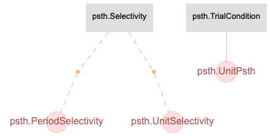
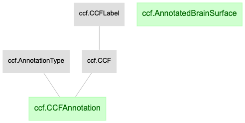

# map-ephys

Mesoscale Activity Project Pipeline - [Map-Ephys](https://github.com/mesoscale-activity-map/map-ephys/)

## Overview

The MAP data pipeline is built using [DataJoint](http://datajoint.io), an
open-source framework for building scientific data pipelines. Users and data
scientists collaborate to define the structure of the pipeline with multiple
stages of data entry, acquisition, processing, and analysis.  They query data
using DataJoint\'s query language.  Experimental data streams are connected
upstream; analyses are made available to downstream applications as soon as new
data are available. DataJoint provides built-in support for parallel and
distributed batch computations. The pipeline is hosted in the [Amazon
Cloud](https://aws.amazon.com) and administered by [Vathes
LLC](https://www.vathes.com/).

The first part of the pipeline deals with entering manual data, and ingesting
and preprocessing the raw acquired data.  Static information like subject
details or experiment parameters are entered manually using
[Helium](https://mattbdean.github.io/Helium/) , a DataJoint-aware web data entry
interface.  These basic data serve as the start of the data pipeline.  From
here, behavioral data are detected as they are written to network shares by the
experimental computers and ingested into the DataJoint pipeline.  Manual spike
sorting is performed offline and separately and then detected and loaded into
the pipeline.  Bulky raw data (behavioral videos; raw ephys files) are
transferred via a separate segment of the pipeline over
[Globus/GridFTP](https://www.globus.org/) to archival storage hosted at ANL and
then removed from the source systems to free storage up space.  The archival
data transfer is managed by DataJoint as part of the pipeline itself; as a
consequence, the raw data can be easily retrieved or more widely published to
other remote users as DataJoint queries.  Additional data navigation and
retrieval interfaces are planned to facilitate more casual internal and public
access to the raw project data and provide support for publication-ready
identifiers such as [DOI](https://www.doi.org/).
 
The second part of the pipeline executes user-maintained analysis of the
acquired data.  The pipeline maintains dependencies between the data at each
stage of acquisition and processing.  As soon as any step of analysis completes
a portion of the data, it becomes available for the next step in analysis in a
distributed fashion.  Thus complex analyses are performed in discrete,
reproducible stages using Matlab or Python query interfaces. In collaborative
scenarios, private \'test\' pipeline segments are first developed and debugged and
then grafted into the main pipeline codebase via code merge/review and then made
available for more permanent or official public use within the team.
 
Cloud hosting of the project pipeline enables sharing of analysis results in
real-time to other collaborators within the project community and, in future
stages of the project, will also allow more public access to the data, both
using DataJoint and also via more casual interfaces under development. Cloud
hosting also allows centralizing the project data into a single data repository
which facilitates easier long-term data stewardship and maintenance.
 
When possible, DataJoint schemas are consistent and compatible with the
[Neurodata Without Borders (NWB)](https://www.nwb.org/) data format, a data
standard for neurophysiology data. The MAP project is currently working with
Vathes to develop interfaces between DataJoint and NWB.
 
References and further information:

- [MAP Project Code Repository](https://github.com/mesoscale-activity-map)
- [MAP Pipeline Advanced User Guide](https://github.com/mesoscale-activity-map/map-ephys/blob/master/README-advanced.md)
- [DataJoint Documentation](https://docs.datajoint.io/)
- [DataJoint Code Repositories](https://github.com/datajoint/)
- [Helium Information Page](https://mattbdean.github.io/Helium/)
- [Helium Code Repository](https://github.com/mattbdean/Helium)
- [Neurodata Without Borders](https://neurodatawithoutborders.github.io/)

## Jupyter Notebook Documentation

Several [Jupyter Notebook](http://jupyter.org/) demonstrations are available in
the `notebook` portion of repository demonstrating usage of the pipeline.

See the jupyter notebook `notebooks/Overview.ipynb` for more details.

## Access via Jupyter Hub

A MAP-dedicated Jupyter Hub can be access at https://map-jupyter.datajoint.io/

Users can sign in using their GitHub account. Please contact chris@vathes.com for database credential if you don't already have one.

Once signed in, the foler `/work` is dedicated for each user to freely experiment with the pipeline. 
Guidelines, tutorial materials, example notebooks can be found under `/workshop` or `/map-ephys/notebook`

## Local Installation and Setup

Direct installation without a source checkout can be done directly via pip:

    $ pip install git+https://github.com/mesoscale-activity-map/map-ephys/

Regular users who will be using the code for querying/analysis should
checkout the source code from git and install the package using pythons's `pip`
command. For example:

    $ git clone https://github.com/mesoscale-activity-map/map-ephys.git
    $ cd map-ephys
    $ pip install -e .

This will make the MAP pipeline modules available to your python interpreter as
'pipeline'. A convenience script, `mapshell.py` is available for basic queries
and use of administrative tasks - see the [advanced user guide](README-advanced.md) for more details.

## Schema

The following section provides a brief overview of the DataJoint
[schemas](https://docs.datajoint.io/data-definition/Create-a-schema.html) in use
within the map-ephys pipeline, along with an
[ERD](https://docs.datajoint.io/data-definition/ERD.html) illustrating the
DataJoint tables within each schema and their relationship to each other.

### Lab

This portion of the pipleine is used to store static laboratory
subject/experimentor related information such as experimenter names, subject
ID's, surgery events, etc. This portion of the schema is copied from the [MAP
Lab](https://github.com/mesoscale-activity-map/map-lab) schema; in the future
the map-ephys data kept here will be merged into a single map-lab database
shared between various experiments in the lab.

### Experiment

This portion of the pipeline is used to store / process experiment related
records such as task, event, and experiment session for for the MAP experiment.

### EPhys

This portion of the pipeline is used to store / process Electrophysiology
related records such as electrode type and position information, detected for
the MAP recordings.

### PSTH

This portion of the pipeline is used to store computed ephys results.

### Tracking

This portion of the pipeline is used to store motion tracking related data.

### CCF

This portion of the pipeline will be used to record annotation information in the Allen Institute's [Common Coordinate Framework](http://help.brain-map.org/download/attachments/2818169/MouseCCF.pdf)

### Histology

This portion of the pipeline is used to store histology related data.

### Report

This portion of the pipeline is used to store tables related to automatic
report image generation.

### Publication

This portion of the pipeline is used to manage the upload/download and tracking
of raw data as published to the petrel service (see [Raw Recording File
Publication and Retrieval](#raw-recording-file-publication-and-retrieval),
below)

